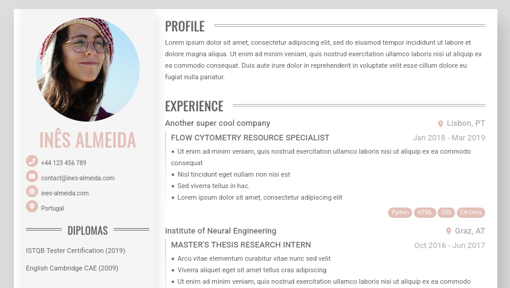
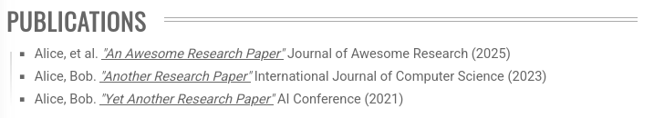
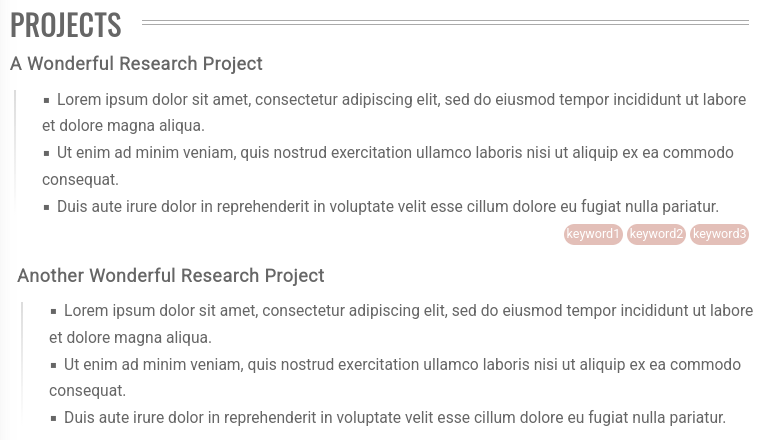
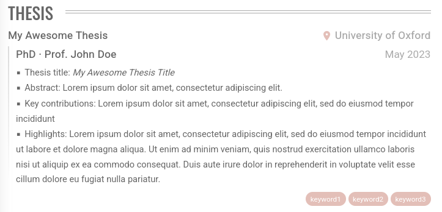

# Almeida CV Theme (Fork)

Printable HTML/CSS CV template based on the original Almeida theme, extended in this fork with multi-CV routing, per-CV language/style control, and new data sections.



Demo site:
- Default page: [https://almeida-cv-demo.netlify.app/](https://almeida-cv-demo.netlify.app/)
- German CV: [https://almeida-cv-demo.netlify.app/cv-de/](https://almeida-cv-demo.netlify.app/cv-de/)
- Chinese CV: [https://almeida-cv-demo.netlify.app/cv-zh/](https://almeida-cv-demo.netlify.app/cv-zh/)

For the original theme, see [Almeida CV](https://github.com/ineesalmeida/almeida-cv).

## What this fork adds

- Multi-CV support from `data/<cv-folder>/` with per-CV route by `slug`
- Per-CV `languageCode` for section labels and page language
- Flexible section ordering via `section_order` and `side_section_order` params
- Per-CV theme/layout overrides (colors, column sizes, spacing, section order)
- New `Publications` section
	- Linked/italic title support
	- Single timeline-style gradient line in front of list
	- Bullet list styling and print-friendly behavior
- New `Projects` section
	- Experience-like visual style
	- Gradient guide line in front of each project's details list
	- Topic, details, and optional badges support
- New `Thesis` section
	- Experience-like visual style (timeline, place icon, bullets, badges)
- Better child spacing controls
	- `child_margin` / `child_padding` now apply to list items as well
- Fixed print behavior for long sections and publication lists

## Requirements

- Hugo (recommended latest)
- See install docs: https://gohugo.io/getting-started/installing/

## Quick start

```bash
hugo server -D
```

Site runs at `http://localhost:1313/`.

Build static output:

```bash
hugo --cleanDestinationDir
```

## Multi-CV data model

This fork generates one CV page per folder under `data/` that contains both:

- `config.toml`
- `content.yaml`

Example:

```text
data/
	content.yaml                 # default homepage CV data
	cv1/
		config.toml               # slug/title/language + params overrides
		content.yaml              # CV content
	cv2/
		config.toml
		content.yaml
```

`slug` in each `data/<cv>/config.toml` controls the URL path:

- `slug = "cv-zh"` -> `/cv-zh/`

## Per-CV config

In `data/<cv>/config.toml`:

```toml
slug = "cv-zh"
title = "CV Chinese"
languageCode = "zh-cn"

[params]
section_order = ["profile", "experience", "projects", "thesis", "publications"]
side_section_order = ["name", "avatar", "contacts", "education", "skills", "languages"]
```

### Global params

- Global style tokens: `colorLight`, `colorDark`, `colorPrimary`, etc.
- Page layout:
	- `[params.section]` / `[params.side_section]` for left/right column width, margin, padding
	- `[params.content]` for page content margin/padding and right column offsets

Supported sections include:

- `name`, `profile`, `experience`, `projects`, `thesis`, `education`, `publications`, `references`
- `avatar`, `contacts`, `skills`, `languages`, `diplomas`, `interests`

### Per-Section params

- Per-section spacing:
	- `[params.<section>]` with `margin`, `padding`, `child_margin`, `child_padding`
- Override section title display with `[params.<section>.display_name]` 

Example:
		
```toml
[params.publications]
display_name = "Journal/Conference Publications"
margin = "0 0 2rem 0"
padding = "0 0 0 0"
child_margin = "0 0 0 0"
child_padding = "0 0 0 0"
```

## Content schema additions

### Publications

```yaml
Publications:
	- Authors: Alice, Bob
		Title: Another Research Paper
		URL: https://example.com/publication
		Publisher: International Journal of Computer Science
		Year: 2023
```

Render style:

- `Authors. "Title" Publisher (Year)`
- Title is italic
- Title is underlined when `URL` is present

Demo:



### Projects

```yaml
Projects:
	- Topic: A Wonderful Research Project
		Details:
			- Lorem ipsum dolor sit amet, consectetur adipiscing elit.
			- Ut enim ad minim veniam, quis nostrud exercitation.
		Badges: [keyword1, keyword2, keyword3]
```

Demo:



### Thesis

```yaml
Thesis:
  - Title: My Awesome Thesis
    Category: PhD
    Place: University of Oxford
    Advisor: Prof. John Doe
    Date: May 2023
    Details:
      - "Thesis title: <em> My Awesome Thesis Title</em>"
      - "Abstract: Lorem ipsum dolor sit amet, consectetur adipiscing elit."
      - "Key contributions: Lorem ipsum dolor sit amet, consectetur adipiscing elit, sed do eiusmod tempor incididunt"
      - "Highlights: Lorem ipsum dolor sit amet, consectetur adipiscing elit, sed do eiusmod tempor incididunt ut labore et dolore magna aliqua. Ut enim ad minim veniam, quis nostrud exercitation ullamco laboris nisi ut aliquip ex ea commodo consequat. Duis aute irure dolor in reprehenderit in voluptate velit esse cillum dolore eu fugiat nulla pariatur."
    Badges: ["keyword1", "keyword2", "keyword3"]
```

Demo:



## Print behavior notes

- CV remains A4-printable.
- Sections follow lead-content behavior similar to existing Experience/Education patterns.
- Publications keeps heading + first item together in print while remaining items can flow.

If your browser print misses backgrounds/badges, enable **Background Graphics** in print settings.

## i18n

Section labels are translated via `i18n/*.toml`.

This fork currently includes thesis/publications/projects labels in:

- `i18n/en.toml` for English
- `i18n/de.toml` for German
- `i18n/es.toml` for Spanish
- `i18n/eo.toml` for Esperanto
- `i18n/fr.toml` for French
- `i18n/pl.toml` for Polish
- `i18n/zh-cn.toml` for Simplified Chinese

## Advanced customization

Create `assets/scss/_custom.scss` in your site root to override style details.

## Credits

- Original theme: https://github.com/ineesalmeida/almeida-cv

## Contributing

Issues and pull requests are welcome.
